<h2 align="center">Hi, I'm Raphael Kenji 👋</h2>

Computer science student at CEFET/RJ, backend developer, and all-around code and game enthusiast.

I'll try writing code in a way that makes it look like I know what I'm doing, but don't be fooled. I have no idea what I'm doing.

<b>Currently diving into:</b> observability, performance tuning and infrastructure 🔧

---

<h3 align="center">Languages, Frameworks and Tools I Like</h3>

  
  
  
  
  
  
  
  
  
  
  
  

---

<h3 align="center">Find me on the web!</h3>

  
  

 

  
  

